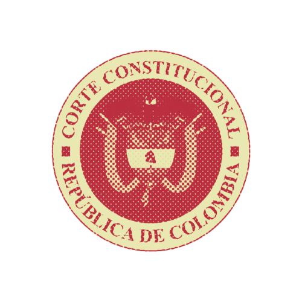

<!-- README.md is generated from README.Rmd. Please edit that file -->

# ccc 

<!-- badges: start -->

[](https://github.com/acastroaraujo/ccc/actions/workflows/R-CMD-check.yaml)
<!-- badges: end -->

The `ccc` package helps get information about rulings from the Colombian
Constitutional Court in a way that is convenient for quantitative
analysis.

You can install the current version from [GitHub](https://github.com/)
with:

``` r
# install.packages("devtools")
devtools::install_github("acastroaraujo/ccc")
```

It provides two main things:

- Various convenient functions for searching and downloading rulings
  directly from the [CCC
  website](https://www.corteconstitucional.gov.co/).

- Various built-in datasets ready for analysis.

A BibTeX entry for LaTeX users is:

    @Manual{,
      title = {ccc: Colombian Constitutional Court data for use in R},
      author = {Andrés {Castro Araújo}},
      year = {2024},
      note = {R package version 0.1.0},
      url = {https://acastroaraujo.github.io/ccc/},
    }
