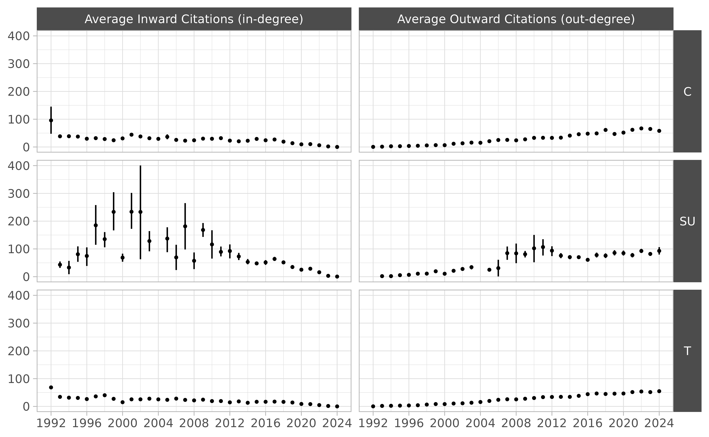
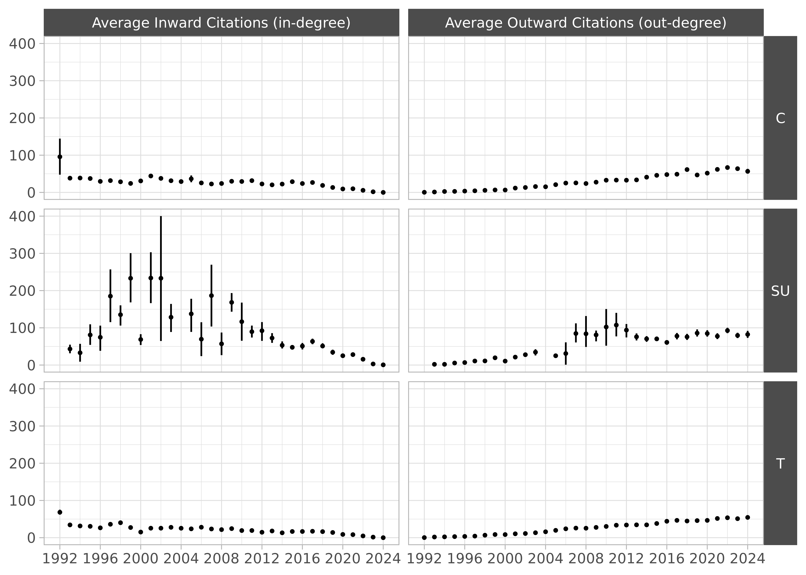
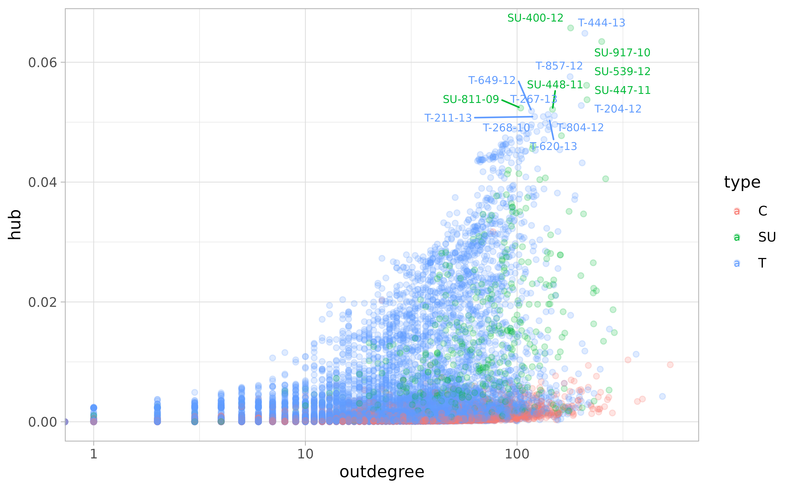

# Data

*Note. All datasets described here were created using [these
scripts](https://github.com/acastroaraujo/ccc/tree/master/data-raw),
which use the functions described in the [search and download
article](https://acastroaraujo.github.io/ccc/articles/search.html).*

``` r
library(ccc)
#> Loading required package: Matrix
#> Para más información:
#> https://www.corteconstitucional.gov.co/relatoria/
```

## 32 Years

`ccc` collects a corpus of over 28,245 rulings made by the Colombian
Constitutional Court (CCC) which cover the period of 32 years
immediately after the first ruling was published on April 3, 1992. All
together, they form a complex citation network with approximately
694,565 ties among them.

Each ruling has a standardized name (e.g., `C-776-03`, `T-025-04`,
`SU-1184-01`). The prefix refers to the type of ruling; the infix
carries no meaning; and the suffix indicates the year in which the
ruling was made.

There are three types of ruling:

- `C` refers to the cases in which the CCC decides whether a law, rule,
  administrative decision is compatible with constitutional norms—also
  known as *judicial review.*

- `T` refers to *tutela*, which is an individual complaint mechanism (or
  special writ) aimed at the protection of fundamental rights. These
  *tutelas* give ordinary citizens the power to go before any ordinary
  judge and request the protection of their “fundamental constitutional
  rights” whenever they perceive them be threatened. Each year, the CCC
  selects approximately 2% of these cases for review, and the final
  decision may uphold or reverse decisions made by lower courts.

  A lot of these cases are related to healthcare access and pensions.

- `SU` refers to decisions in which the Court has decided to compile
  several `T` cases. They are a sort of legally binding “Annual Reviews”
  for the judicial system in Colombia.

### Citations

`metadata` contains information on each ruling.

``` r
metadata
#> # A tibble: 28,245 × 9
#>   id      type   year date       indegree outdegree word_count descriptors url  
#>   <chr>   <fct> <int> <date>        <int>     <int>      <int> <list>      <chr>
#> 1 T-001-… T      1992 1992-04-03      188         0       7060 <chr [14]>  http…
#> 2 C-004-… C      1992 1992-05-07      119         0      20107 <chr [11]>  http…
#> 3 T-002-… T      1992 1992-05-08      286         0       7597 <chr [4]>   http…
#> 4 T-003-… T      1992 1992-05-11      146         0       5760 <chr [8]>   http…
#> 5 C-005-… C      1992 1992-05-11        7         1       6869 <chr [11]>  http…
#> 6 T-006-… T      1992 1992-05-12      228         0      32408 <chr [21]>  http…
#> # ℹ 28,239 more rows
```

`citations` contains the citation network in “edge list” format. Each
citation has a `weight` that refers to the *number* of times a ruling
cites a previous case.

``` r
citations
#> # A tibble: 694,565 × 5
#>   from     to       weight from_date  to_date   
#>   <fct>    <fct>     <int> <date>     <date>    
#> 1 C-001-18 C-004-93      1 2018-01-24 1993-01-14
#> 2 C-001-18 C-007-01      1 2018-01-24 2001-01-17
#> 3 C-001-18 C-008-17      2 2018-01-24 2017-01-18
#> 4 C-001-18 C-030-03      1 2018-01-24 2003-01-28
#> 5 C-001-18 C-037-96      3 2018-01-24 1996-02-05
#> 6 C-001-18 C-041-93      1 2018-01-24 1993-02-11
#> # ℹ 694,559 more rows
```

The following figure is my best attempt at visualizing the whole thing:

*Note. The lines
separating the citations into small squares correspond to the End of
Year vacation period. Also, if you squint at the column for 2020, you’ll
be able to see the effects of COVID on the court activity.*

There is also a convenient function that turns these two datasets into a
squared adjacency matrix.

``` r
M <- create_citation_adj_mat()
dim(M)
#> [1] 28245 28245
```

The resulting matrix $M$ is very sparse. It has 797,780,025 cells and
only 0.087% are non-zero.

### Time Traveling

A citation network $\mathbf{M}$ is always **directed, asymmetric**, and
**acyclic**—i.e., it points backwards in time.

Let’s assume that $\mathbf{M}$ is lower triangular, meaning that all
elements above the main diagonal are zero. This happens when the
documents are arranged from first to last, the rows represent source
documents, and the columns represent target documents. The main diagonal
is also zero because we won’t allow any document to cite itself.

*Note. The direction of the citation can be considered backwards in time
(i.e., documents citing past documents) or forwards in time (i.e.,
knowledge flowing from documents to future documents). Here I use a
backward-looking convention. In acyclic temporal graphs of this sort,
the in-degree of the earliest node is always zero and the out-degree of
the newest node is also always zero.*

However, the CCC matrix is *not* lower triangular. Some documents cite
each other in a way that creates the illusion of time travel because the
court has been writing them simultaneously. In some (very few) cases a
ruling will cite another one that will be published a couple months
later.

Other rulings have been modified many years later for privacy
concerns—e.g., `T-1003-99`. In such cases the CCC has modified the
original to text to ensure that the names of the parties involved are
rendered anonymous.

These sorts of modifications are usually prefaced by a small editorial
note at the beginning of the document.

``` r
url <- "https://www.corteconstitucional.gov.co/relatoria/1999/T-1003-99.htm"
txt <- ccc_txt(url)
#> https://www.corteconstitucional.gov.co/relatoria/1999/T-1003-99.htm

txt |>
  stringr::str_trunc(width = 300) |>
  stringr::str_squish() |>
  stringr::str_wrap() |>
  cat()
#> NOTA DE RELATORIA: Mediante auto 397 de fecha 19 de julio de 2019, el cual se
#> anexa en la parte final de esta providencia, se ordena suprimir el nombre y los
#> datos que permitan identificar al accionante y, en su lugar, sustituirlos por el
#> nombre ficticio de “Miguel”. Sentencia T-1...
```

This document is also accompanied by a small text—labeled *Auto
397/19***—**which contains citations to future rulings that deal with
the issue of anonymity in public documents. There are more examples of
this kind of time travel in the CCC dataset.

Thus, the upper triangular section of the $\mathbf{M}$ matrix for the
Colombian Constitutional Court has various non-zero entries.

``` r
sum(M[upper.tri(M)] > 0L)
#> [1] 366
```

### Text Features

*See Denny and Spirling (2018) for an in-depth discussion of various
pre-processing steps (e.g., removal of stop words, lemmatization,
lowercasing).*

The `docterms` dataset contains a data frame with document identifiers
(`id`) and word counts (`lemma` and `n`). It has 24,836,293 rows.

``` r
docterms
#> # A tibble: 24,836,293 × 3
#>   id       lemma          n
#>   <fct>    <fct>      <int>
#> 1 T-001-92 abril          1
#> 2 T-001-92 abstencion     1
#> 3 T-001-92 abstener       2
#> 4 T-001-92 acabar         3
#> 5 T-001-92 acatar         2
#> 6 T-001-92 acceder        2
#> # ℹ 24,836,287 more rows
```

This dataset contains 28,245 unique documents with a vocabulary size of
7,238.

The
[`create_dtm()`](https://acastroaraujo.github.io/ccc/reference/create_dtm.md)
function creates a sparse document-term matrix from the information
contained in `docterms`.

``` r
A <- create_dtm()
dim(A)
#> [1] 28245  7238
```

Close to 91% of the cells in this matrix are empty, which is why we call
it a “sparse matrix.”

``` r
mean(A == 0L)
#> [1] 0.8785139
```

Here is a random subset of $\mathbf{A}$:

``` r
set.seed(1111)
i <- sample(1:nrow(A), 10)
j <- sample(1:ncol(A), 5)
A[i, j]
#> 10 x 5 sparse Matrix of class "dgCMatrix"
#>          accionada arbitrario diferenciado escenario indigencia
#> T-432-21         .          2            1         .          .
#> T-034-21         .          .            .         .          .
#> T-667-02         .          .            .         .          .
#> C-256-08         .         10            1         .          .
#> T-718-17         .          .           15         2          .
#> C-676-01         .          .            .         .          .
#> T-273-97         .          .            .         .          .
#> T-867-02         .          1            .         .          .
#> T-494-92         .          .            .         .          .
#> C-942-08         .          .            .         .          .
```

### Centrality

#### Citations Across Time

The following Figure shows average in-degree (citations) and out-degree
(references) made in each ruling across the years. Note that, on
average, the decisions written during 1992 tend to be significantly more
cited that the ones written in other years, giving them some sort of
“first-movers advantage” over the others—i.e., the most innovative thing
of any kind is the first of its kind.



Fowler and Jeon (2008) interpret the panel on the right as evidence that
the legal norm of *stare decisis* is becoming stronger, but that’s
definitely wishful thinking. Leskovec, Kleinberg, and Faloutsos (2007)
show that that out-degree tends to grow over time in many different
kinds of networks.

The following Figure disaggregates both kinds of citation by *type of
ruling.*

    #> Warning: The `fatten` argument of `geom_pointrange()` is deprecated as of ggplot2 4.0.0.
    #> ℹ Please use the `size` aesthetic instead.
    #> This warning is displayed once every 8 hours.
    #> Call `lifecycle::last_lifecycle_warnings()` to see where this warning was
    #> generated.



#### Hubs and Authorities

Instead focusing on in-degree or out-degree, we can follow Fowler and
Jeon (2008) in calculating more sophisticated measures of centrality.

The key insight is that we can transform the original (unweighted)
citation matrix in two different ways:

- A **co-citation** matrix in which any two rulings are connected by the
  total number of other rulings that cite both. The `cocitation()`
  function in `igraph` makes the following calculation:

  $$\mathbf{C} = \mathbf{M}^{\top}\mathbf{M}$$

- A **bibliographic coupling**, in which any two rulings are connected
  by the number of common references. The `bibcoupling()` function in
  `igraph` makes the following calculation:

  $$\mathbf{B} = {\mathbf{M}\mathbf{M}}^{\top}$$

Here, the diagonal elements of $\mathbf{C}$ correspond to the in-degree
for each ruling (or the row sums of $\mathbf{M}$); whereas the diagonal
elements of $\mathbf{B}$ correspond to the out-degree for each ruling
(or the column sums of $\mathbf{M}$).

Following Kleinberg (1999), Fowler and Jeon (2008) calculate *authority*
and *score* hubs for each ruling. These are the first eigenvectors of
$\mathbf{C}$ and $\mathbf{B}$ respectively. Ronald Breiger once noted
that *“several stories might be, and are, told about eigenvectors. They
are the low-dimensional scaffolds that support higher-dimensional
structures.”* In social networks, eigenvectors are interpreted as a
measure of “centrality” which roughly translates to the extent to which
a node well-connected to other well-connected nodes.

In this case, the story is supposed to go something like this:

> The authority score of a case depends on the number of times it is
> cited and the quality of the cases that cite it. Symmetrically, the
> hub score of a case depends on the number of cases it cites and the
> quality of the cases cited. Thus, authority scores indicate the degree
> to which a case is thought to be important for resolving other
> important issues that come before the Court, while hub scores indicate
> the degree to which a case is well-grounded in previous important
> rulings.
>
> Fowler and Jeon (2008, 17)

Calculating these scores is pretty straightforward using the `igraph`
package:

Measurements of authority are correlated with in-degree measurements,
but they’re not the same thing.



*Note. Given the large number of `T` cases, it makes sense that the most
“central” C rulings define what a tutela is (`C-543-92`) and further
clarify the circumstances under which a tutela can be presented against
decisions made by lower courts (C-590-05).*

The same goes for “hub” and “out-degree” measurements.


*Note. It makes sense that SU rulings are heavily represented as
“hubs.”*

Finally, note that authority and hub scores are somewhat related to each
other; however, by definition, the very first rulings can never be hubs
and the very last rulings can never be authorities. Hence we see three
clusters.


### Length of Documents

Along with the increase in citations over time, an important feature of
how the CCC rulings have evolved over time concerns the length of each
document.

There is a variable called `word_count` in the `metadata` dataset which
allows us to see changes over time.


## References

Denny, Matthew J., and Arthur Spirling. 2018. “Text Preprocessing for
Unsupervised Learning: Why It Matters, When It Misleads, and What to Do
about It.” *Political Analysis* 26 (2): 168189.

Fowler, James H., and Sangick Jeon. 2008. “The Authority of Supreme
Court Precedent.” *Social Networks* 30 (1): 1630.

Kleinberg, Jon M. 1999. “Authoritative Sources in a Hyperlinked
Environment.” *Journal of the ACM* 46 (5): 604632.
<https://doi.org/10.1145/324133.324140>.

Leskovec, Jure, Jon Kleinberg, and Christos Faloutsos. 2007. “Graph
Evolution: Densification and Shrinking Diameters.” *ACM Transactions on
Knowledge Discovery from Data (TKDD)* 1 (1): 2es.
